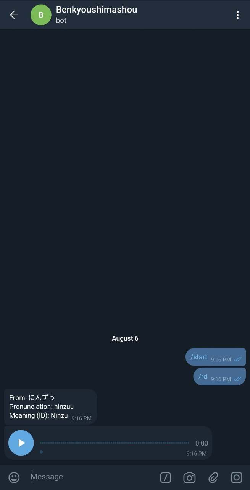

### Japanese Learning Telegram Bot

### Feature
1. Translate ID to JP
2. Send Random Word with meaning
3. Send Random Sentence
4. Send Random word + sentence example every X time (customize)

### Requirements
1. python 3.8
2. pandas
3. python-telegram-bot
4. googletrans
5. gtts
6. romkan
7. pykakasi
8. beautifulsoup4

### Demo
Link: [t.me/benkyoushimashou_bot](t.me/benkyoushimashou_bot)

### Screen Capture
1. List Command
	
	
2. Send random word
	

3. Send random sentence
	

4. Translate multi language
	

5. Send word and sentence example by time X (customize)
	

Happy Coding and Happy Learning. 

頑張りましょう！